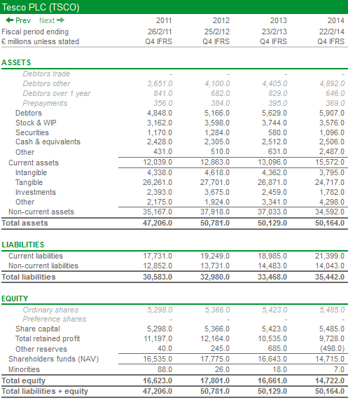

# Balance sheets

The balance sheet is possibly the most important of the financial statements. It shows a company's financial position at a specific point in time, usually the end of a year, and holds the company's financial transactions over a period.

Company's publish balance sheets every year in their annual report and accounts. Listed companies will publish every three or six months as well.

The clue is in the name but balance sheets will always balance, and are based on the accounting equation:

`Net assets = Shareholders funds (equity)`

Balance sheets are usually split into three main sections:

1. Total assets

2. Total liabilities

3. Total equity

*Assets* are what a company owns.

*Liabilities* are what it owes.

*Equity* is the value of the shareholders stake since the business started trading. This is the same amount that they have invested plus any profits that have been retained in the company, and is also the same as the company's Total assets minus its Total liabilities.

All the numbers in a balance sheet help to explain a company's financial position.

## Simple example of a balance sheet

Lets use a simple example to show how a balance sheet works.

John inherits £50,000, so decides to set up a property company and buy a house for £100,000 to rent out. He spends £40,000 of the inheritance as a deposit, borrows £60,000 from a bank, and keeps £10,000 to renovate the house.

The first balance sheet will look like below:

| Description | Amount |
| --- | --- |
| Fixed assets (House) | £100,000 |
| Current assets (Cash) | £10,000 |
| Total Assets | £110,000 |
| Liabilities (Mortgage) | -£60,000 |
| **Net assets** | **£50,000** |
| Share Capital | £50,000 |
| Retained Profits | £0 |
| **Equity** | **£50,000** |

There are two parts to the balance sheet. One side lists all the assets of the company (what it owns or is owed to it), and the other lists all its liabilities (what it owes to others). 

To calculate the net assets the liabilities are deducted from the value of the assets.

The net assets looks at how these assets are financed by the company's shareholders.

Different companies have different terminology, for example in the US net assets are called net worth, and are an estimate of what would be left over if all the companies assets were sold and all the liabilities paid off.

Share Capital is the money that John invested in the business, in this case the inheritance.

The rest of the balance sheets is made up of reserves, the most significant being the retained profits - which are profits that have been earned but not paid out to sharedholders. This is valued at £0 because the business hasn't produced any profits yet.

Because the business hasn't paid out any profits yet shareholders funds remain at £50,000, the same as the net assets so everything balances.

### New transactions

John now decides to spend £5,000 on furniture and a new central heating system for the property.

| Description | Before | Furniture + CH | After |
| --- | --- |
| Fixed Assets (House) | £100,000 | £5,000 | £105,000 |
| Current Assets (Cash) | £10,000 | -£5,000 | £5,000 |
| Total assets | £110,000 | | £110,000 |
| Liabilities (Mortgage) | -£60,000 | | -£60,000 |
| **Net assets** | **£50,000** | | **£50,000** |
| Share Capital | £50,000 | | £50,000 |
| Retained Profits | £0 | | £0 |
| **Equity** | **£50,000** | | **£50,000** |

Again, net assets and equity balance at £50,000. All we've done here is reduce the cash balance by the £5,000 spent and increase the fixed assets by the same amount to account for the furniture and central heating system.

In this balance sheet no new money has come into the business, and no profit has been made by the business so the shareholders fund (equity) stays the same at £50,000.

### When profits are made

Eventually John finds some tenants and after a year has made a profit of £5,000 after paying out all expenses and tax. Instead of paying the shareholders (i.e. himself) a dividend he decides to retain the profit in the business.

This profit will impact both the net assets and equity (shareholders' fund) - net assets will go up by £5,000 to reflect the cash entering the business, and equity will go up by the same amount to reflect the profits gained, so the sheet still balances with net assets and shareholders' fund of £55,000.

| Description | Before | Change | After |
| --- | --- |
| Fixed Assets (House) | £105,000 | | £105,000 |
| Current Assets (Cash) | £5,000 | £5,000 | £10,000 |
| Total assets | £110,000 | | £115,000 |
| Liabilities (Mortgage) | -£60,000 | | -£60,000 |
| **Net assets** | **£50,000** | | **£55,000** |
| Share Capital | £50,000 | | £50,000 |
| Retained Profits | £0 | £5,000 | £5,000 |
| **Equity** | **£50,000** | | **£55,000** |

## US company balance sheets

US companies lay out their balance sheets differently in their annual reports. The numbers are still the same, just entered differently.

Taking the accounting equation for UK balance sheets:

`Net assets = Shareholder funds (equity)`

we can break it down to:

`Total Assets - Total Liabilities = Equity`

which, rearranging the equation is the same as:

`Total Assets = Total Liabilities + Equity`

So using the same examples as above but with dollars instead, we would write a US balance sheet as follows:

| Description | Amount |
| --- | --- |
| Fixed Assets (House) | $105,000 |
| Current Assets (Cash) | $10,000 |
| **Total assets** | **$115,000** |
| Liabilities (Mortgage) | $60,000 |
| Share Capital | $50,000 |
| Retained Profits | $5,000 |
| **Equity** | **$55,000** |
| **Total Liabilities plus Equity** | **$115,000** |

The US balance sheet is only slightly different - on one side are all the company's assets, and on the other are all the company's liabilities and the shareholders equity.

## Example: Tesco Plc

Below is Tesco Plc's balance sheet, in US format.

### Current assets

Current assets are assets that are expected to be transformed into cash within a year of the balance sheet date.

The main types of current assets are:

**Stock & work in progress**

Stock or inventory are goods held for resale. Work in progress goods are items that are part finished. The raw materials used to make the goods can also be included in stock and work in progress.

Here, Tescos are holding £3.7bn of stock and work in progress as of the balance sheet date.

**Debtors**

These are the amounts of money owed to the company. Most of the time the biggest type of debtor for a company is the trade debtor - this is money owed to it by customers for goods and services sold where the cash has not yet been received.

A trade debtor is usually created by selling goods or services on credit.

Here, Tescos have £5.5bn of debtors less prepayments at the balance sheet date. This should end up as cash coming into the business during the next year.

**Prepayments**

Prepayments are when the company pays for services in advance but has not yet received them. This could be paying for stock which has not yet been delivered.

Prepayments are treated as an asset because effectively they are owed to the company, which is a risk (although usually small) because the goods or services may not be delivered and that money will have to be written off.

Here, Tescos have prepayments of £369m at the balance sheet date.

**Securities & cash**

Securities are where a company puts surplus money into bonds or shares to earn a higher return than as cash on the balance sheet.

Cash is exactly what it sounds like, cash the company holds.

Here, Tescos have cash and securities of £3.6bn at the balance sheet date.

### Non-current assets

Non-current assets are intended for continued use in the business and are not for sale.

They are usually divided into three categories:

1. Intangible assets

2. Tangible assets

3. Investments

**Intangible assets**

These are assets you can't physically hold, and can be either purchased by the company or developed within it. Some business such as pharmaceuticals, software or consumer goods can have very large intangible assets on their balance sheets.

They are not always easy to value and there are rules for how to represent them on a balance sheet. The values you will see are the net values after a net change called *amortisation* has been deducted.

They can include things like:

- Brands

- Patents

- Trademarks

- Publishing titles

- Goodwill

If a company had an intangible asset with an original cost of £10 million, and a lifespan of 10 years after which it wouldn't be worth anything, the company could choose to evenly charge £1m per year in amortisation (known as a straight line method of amortisation).

Here, Tescos have £3.8bn worth of intangible assets as at the balance sheet date.

**Tangible assets**

These are assets you can physically touch, used in the business over years, frequently for making the actual goods to be sold. The balance sheet measures tangible assets by their net book values which are calculated by taking the original cost of the asset and deducting the amount of accumulated depreciation.

Tangible assets include things like:

- Land and buildings

- Plant and machinery

- Motor vehicles

- Fixtures and fittings

Depreciation is very important in a company's financial statements, it is similar to amortisation and charged against the value of an asset over its estimated useful life. Depreciation can be interpreted in different ways such as the reduction in value of an asset, or an estimate of how much the company needs to spend annually to keep the asset in its original condition.

In this balance sheet Tesco has a lot of tangible assets - the supermarket buildings and all the fixtures and fittings inside them such as shelves, fridges, checkouts. It also includes the land the supermarkets are built on, which is the biggest part of the balance sheet, totalling £24.7bn.

Here, Tescos have £50.164bn of total assets (current plus non-current assets) as at the balance sheet date.

**Investments**

Investments include the value of stakes in other companies (where the ownership stake is 50% or less) known as joint ventures and associates. It also includes long term investments in shares or bonds.

### Current liabilities

These are liabilities the company usually has to pay within one year of the balance date.

They can include things like:

- Bank loans

- Tax owed

- Trade creditors: amounts owed to suppliers

- Accruals: an estimate of an amount for goods and services used but where no bill has yet been received

Here, Tescos have £21.4bn of current liabilities at the balance sheet date, mostly made up of trade creditors.

### Non-current liabilities

These are liabilities that are due after one year.

Common items in this category are:

- Long-term borrowings

- Deficits of final salary pension schemes

- Provisions: amounts set aside for future costs based on a decision already taken, e.g. demolition of a factory site

For Tescos, these total at just over £14bn.

Tesco's total liabilities add up to £35.4bn at the 2014 balance sheet date. Deducted from the £50.164bn of total assets results in £14.7bn of net assets left over.

### Equity

Equity is the sum of share capital plus reserves.

The main items of equity are:

- Share capital: the number of shares issued multiplied by a nominal value that is the minimum value shares can be issued for

- Share premium: the amount above the nominal value paid for a share

- Retained profits: profits made by the company not paid as dividends to shareholders

In basic terms, the shareholders equity of a company is the amount of money paid in by shareholders (share capital + share premium) plus all the retained profits.

As the balance sheet must always balance, this is equal to the value of its net assets.

For 2014, this was £14.7bn for Tescos.

## References

[Balance sheets](https://www.sharescope.co.uk/stepbystep_2.jsp)